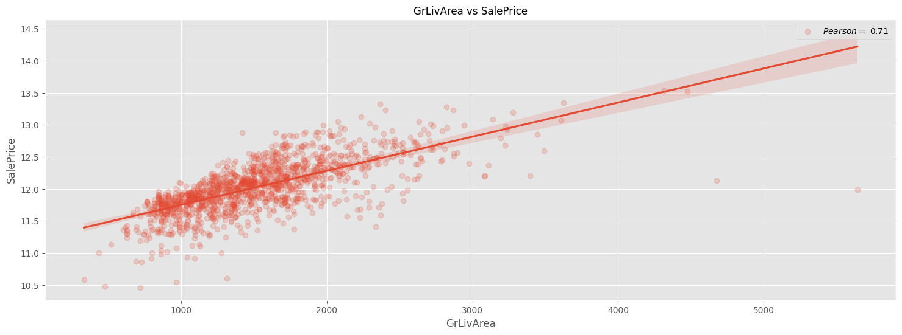
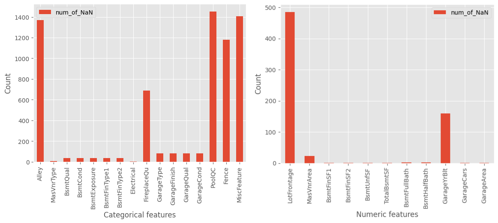
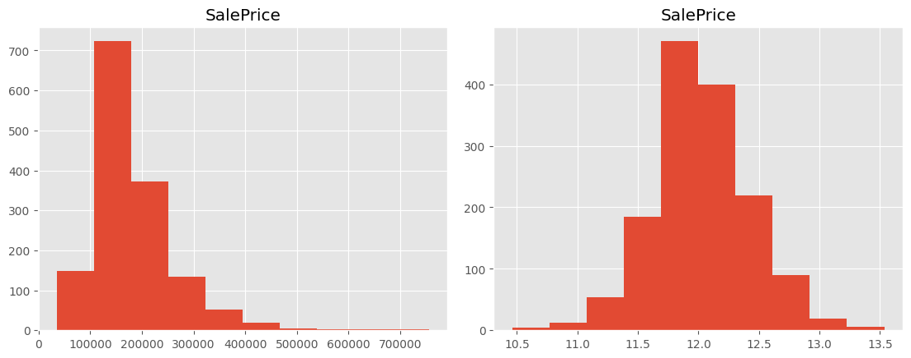

# House Prices Competition from Kaggle
🏠 🏠 Predict sales prices and practice feature engineering 🏠 🏠

[House Prices: Advanced Regression Techniques Competition on Kaggle](https://www.kaggle.com/c/house-prices-advanced-regression-techniques)
## Что было сделано?
1. :chart_with_upwards_trend: Визуализация зависимости фичей от таргета:

2. :construction_worker: Заполнение пропущенных значений и работа с категориальными данными:

3. :ok_hand: Нормирование таргета:

4. :pencil: Анализ качества работы различных моделей:

5. Загрузка результата на kaggle и вхождение в топ 10% участников :)

## ✨Contributing✨
1. Fork it!
2. Create your feature branch: `git checkout -b my-new-feature`
3. Commit your changes: `git commit -am 'Add some feature'`
4. Push to the branch: `git push origin my-new-feature`
5. Submit a pull request :heavy_check_mark:

